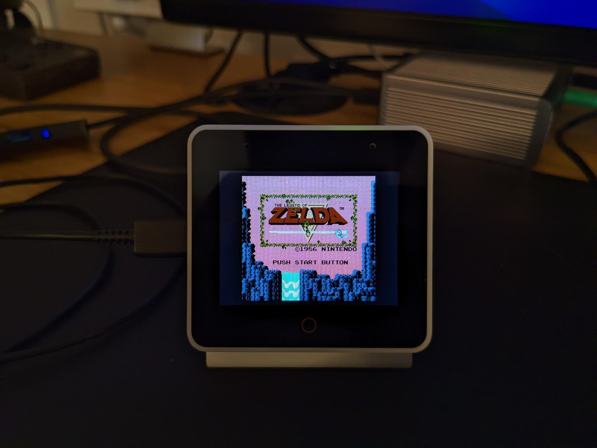
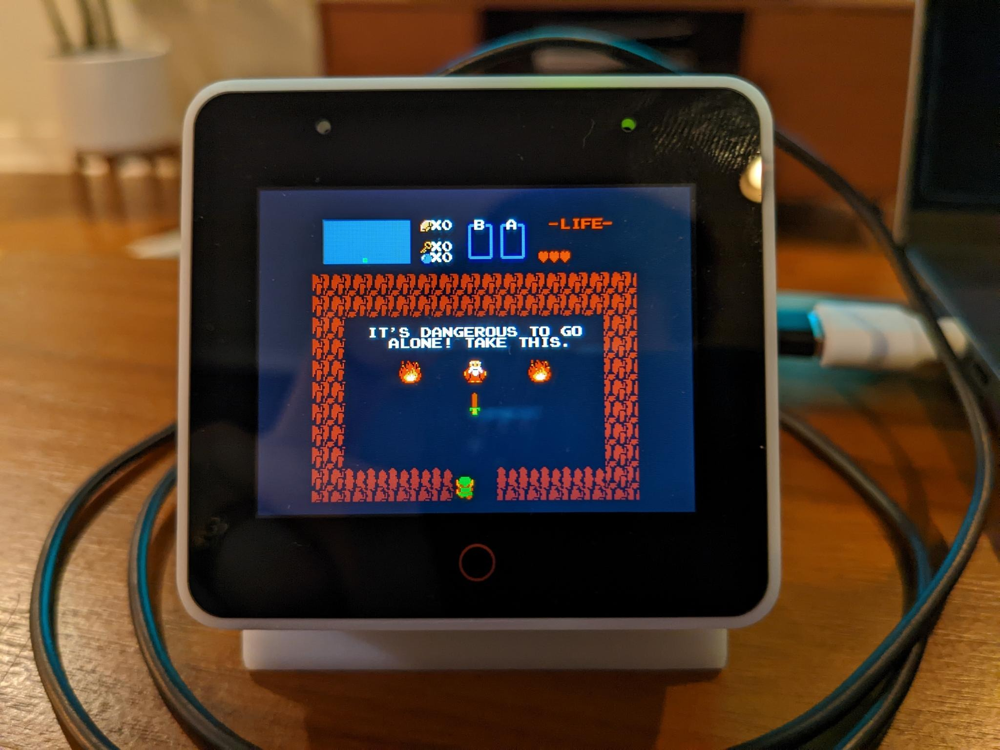
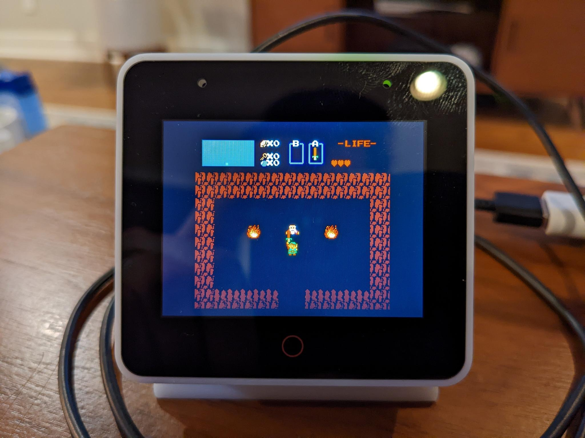

# esp-box-emu
Emulator(s) running on ESP BOX

## Description

This project is a little retro game emulation system running on ESP32-S3-BOX. It
is built using the following:

- [ESPP](http://github.com/esp-cpp/espp)
- [LVGL](http://github.com/lvgl/lvgl)
- [Squareline Studio](http://squareline.io) (for designing and generating LVGL)
- Nofrendo (NES emulator)
- GNUBoy (GB / GBC emulator)

## Videos

https://user-images.githubusercontent.com/213467/199843965-1bf38a5f-2cc6-4ff0-adba-bbd67b366bc3.mp4

## Images

<table style="padding:10px">
    <tr>
        <td></td>
        <td></td>
        <td></td>
        <td></td>
    </tr>
    <tr>
        <td></td>
        <td></td>
        <td></td>
        <td></td>
    </tr>
</table>

## Planned Features

This project is designed to have:

 - [x] LVGL gui for selecting emulators / roms (showing boxart and name)
 - [x] LVGP gui for controlling settings (such as volume)
 - [x] BT Gamepad input (see note below) 
 - [x] Loading of gui data (rom titles and boxart) from metadata file
 - [x] Audio output (using I2S + es8311 audio codec)
 - [x] Interaction with analog joystick + buttons
 - [x] Interaction with touchscreen
 - [ ] Emulators to choose from:
   - [x] NES emulator
   - [x] GB/GBC emulator
   - [ ] SNES emulator
   - [ ] SMS / Genesis emulator
 - [x] LittleFS file system for local storage of roms and metadata
 - [x] Memory mapping of selected rom data from littlefs partition into raw data
       partition (SPIFLASH)
 - [X] Emulator framebuffers on SPIRAM 
 - [ ] FTP Client for browsing remote FTP server of roms and displaying their
       data in LVGL
 - [ ] Interaction with d-pad + buttons
 - [ ] Feedback through BLDC haptic motor (see
       https://github.com/scottbez1/smartknob)
 
 NOTE: For gamepad input I'm currently using the associated
 [controller.py](./controller.py) script which will send the input reports from
 a BT gamepad (in this case an 8BitDo Pro 2) over UDP to the ESP-BOX-EMU which
 converts those input reports and sets the state of the input device for the NES
 emulator appropriately.
    
 Down the line I'd like to add the ability to load the emulator cores from the
 FTP server (which would be pre-compiled ESP32 libraries) so that they wouldn't
 take up as much space on the ESP32 itself. Right now that's not a huge concern
 though because the ESP (S3 module in the ESP BOX especially) has more than
 enough flash for the emulators so assuming their RAM can be managed it won't be
 much of an issue.
 
 Info for loading elf files at runtime:
 https://github.com/niicoooo/esp32-elfloader.
 [Here](https://github.com/joltwallet/jolt_wallet/tree/master/jolt_os/jelf_loader)
 is another implementation.

## Flashing

Note: you will need to set up a `flash_data/` folder which contains your roms
(.nes, .gb, .gbc), images (.sjpg), and metadata.csv. 

NOTE: the images must be converted to `sjpg` from `jpg`, and must be 100x100 px
jpgs beforehand. 

For ease of use, there is a
[./boxart/source/resize.bash](./boxart/source/resize.bash) script which will
resize all `jpg` images in the `boxart/source` folder to be 100x100 px and put
the resized versions in the `boxart` folder. From there, you can simply run:

``` shell
find . -maxdepth 1 -iname "*.jpg" -exec python jpg_to_sjpg.py {} \;
```

to convert all the jpg files into sjpg files. You can discard the `.bin` and
`.c` files that are also generated.

### Metadata.csv format

``` csv
<rom filename>, <rom boxart filename>, <rom display name>
```

Example:

``` csv
mario.nes, boxart_mario.sjpg, Mario Bros.
zelda.nes, boxart_zelda.sjpg, The Legend of Zelda
megaman.nes, boxart_megaman.sjpg, MegaMan
metroid.nes, boxart_metroid.sjpg, Metroid
pokemon_yellow.gbc, boxart_pokemon_yellow.sjpg, Pokemon Yellow
links_awakening.gb, boxart_links_awakening.sjpg, The Legend of Zelda: Link's Awakening
```

## References and Inspiration:

### ESP32 S3 Box Info:

It uses GPIO_NUM_46 to control power to the speaker, so if you do not set that
as output HIGH, then you will never hear anything T.T

The ESP32 S3 Box has two PMOD headers, PMOD1 and PMOD2, which have the following
pins:

* PMOD1
  * IO40 (I2C_SCL)
  * IO41 (I2C_SDA)
  * IO38
  * IO39
  * IO42
  * IO21
  * IO19 (USB_D-, U1RTS, ADC2_CH8)
  * IO20 (USB_D+, U1CTS, ADC2_CH9)
* PMOD2
  * IO09 (FSPIHD, TOUCH9, ADC1_CH8)
  * IO10 (FSPICS0, TOUCH10, ADC1_CH9)
  * IO11 (FSPID, TOUCH11, ADC2_CH0)
  * IO12 (FSPICLK, TOUCH12, ADC2_CH1)
  * IO13 (FSPIQ, TOUCH13, ADC2_CH2)
  * IO14 (FSPIWP, TOUCH14, ADC2_CH3)
  * IO44 (U0RXD)
  * IO43 (U0TXD)

#### LCD

The LCD is a ST7789 320x240 BGR display connected via SPI.

ESP32s3 LCD Pinout:
* IO4: Data / Command
* IO5: Chip select
* IO6: Serial Data
* IO7: Serial Clock
* IO48: LCD Reset
* IO45: LCD Backlight control

#### Touch

The ESP32S3 Box uses a capacitive touch controller connected via I2C.

The touch driver is either the TT21100 or Ft5x06 chip.

NOTE: it appears the one I have (regular ESP32 S3 BOX) which has the red circle
at the bottom of the display (the `HOME` button) uses the TT21100 chip.

#### Audio

The ESP32s3 Box has a few audio codec coprocessors connected simultaneously to
I2S (data) and I2C (configuration). It uses an encoder codec chip (ES7210) for
audio input from the multiple mics on-board, and a decoder chip (es8311) for
audio output to the speaker (output power controlled by GPIO 46).

ESP32s3 Audio Pinout:
* IO2: I2S MCLK
* IO17: I2S SCLK
* IO47: I2S LRCK
* IO15: I2S Data Out
* IO16: I2S Data In
* IO46: Speaker Power Control (for the NS4150 audio amplifier)

I2C Pinout:
* IO18: I2C SCL
* IO08: I2C SDA

### Controllers

#### Sparkfun QwiicNES

The Sparkfun QwiicNES ([product page](https://www.sparkfun.com/products/18038),
[library](https://github.com/sparkfun/SparkFun_QwiicNES_Arduino_Library)) is a
NES controller adapter that supports direct GPIO and I2C. The
[controller](./components/controller) component we have supports direct GPIO
configuration if you choose to use it (find the configuration in the
[./components/box-emu-hal/src/input.cpp](./components/box-emu-hal/src/input.cpp)).

It also however has a ATmega 32u4 which allows it to act as a USB gamepad and
exposes the NES gamepad over I2C as well. For ease of use, the I2C functionality
has been wrapped into a [qwiicnes component](./components/qwiicnes).

#### Joy bonnet

The [joy bonnet](https://pinout.xyz/pinout/joy_bonnet) was designed as a
raspberry pi hat which has abxy, start/select, analog joystick, and player 1 /
player 2 buttons. It's useful for prototyping input / hardware and testing how
well the emulators run (by playing them of course ;) )

Pinout (pin number is w.r.t. header, not pi GPIO):
* A: pin 32
* B: pin 31
* X: pin 36
* Y: pin 33
* Start: pin 37
* Select: pin 38
* Ground: pins 6, 9, 14, 20, 25, 30, 34, 39
* 5V: pins 2, 4
* 3V3: pins 1, 17

The Joystick is accessible via an I2C ADC ([see
here](https://github.com/adafruit/Adafruit-Retrogame/blob/master/joyBonnet.py)):
* SDA: pin 3
* SCL: pin 5
* Chipset: ADS1015
* Default Address: 0x48
* Y-axis: Channel 0
* X-axis: Channel 1

### Other NES Emulators
* https://github.com/nesemu/NESemu
* https://github.com/NiwakaDev/NIWAKA_NES
* https://github.com/kanathan/plainNES
* https://github.com/blagalucianflorin/lbnes
* https://github.com/daniel5151/ANESE
* https://github.com/Grandduchy/YaNES

### Useful Background / Information
* https://www.zophar.net/nes.html
* https://yizhang82.dev/nes-emu-overview
* https://www.gridbugs.org/zelda-screen-transitions-are-undefined-behaviour/
* https://bgb.bircd.org/pandocs.htm
* https://github.com/pebri86/esplay-gb
* https://github.com/hex007/esp32-gnuboy
* https://github.com/rofl0r/gnuboy
* https://github.com/zid/gameboy
* https://github.com/Jean-MarcHarvengt/MCUME
* https://github.com/OtherCrashOverride/go-play
