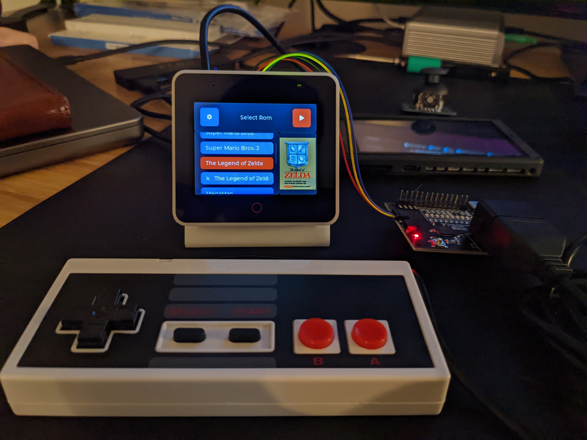
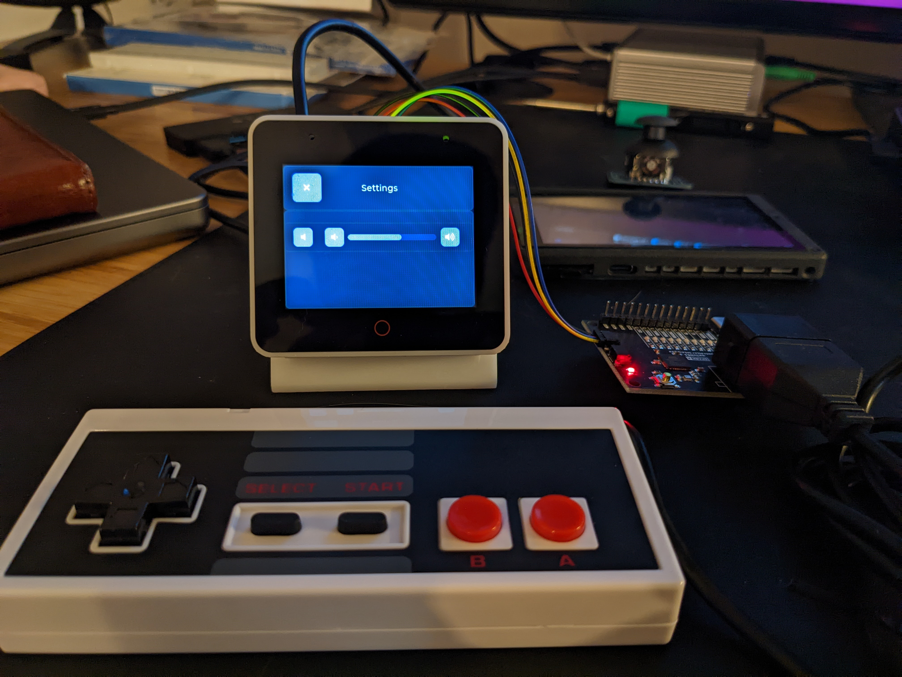
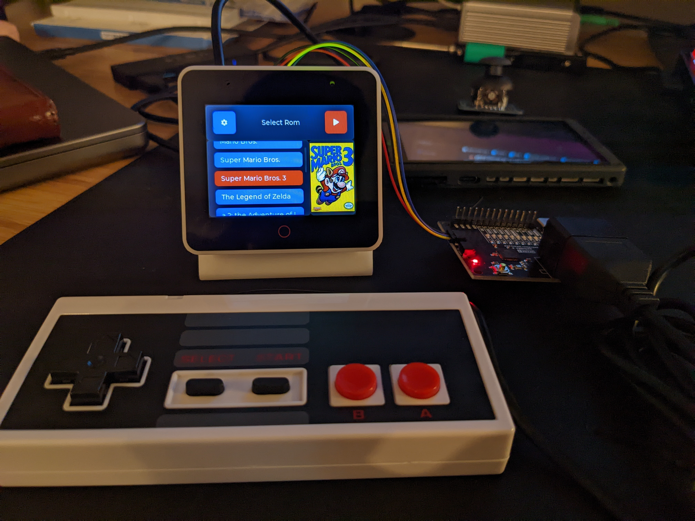
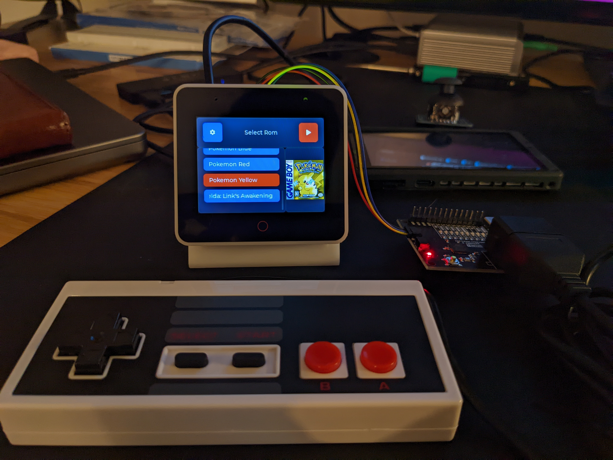
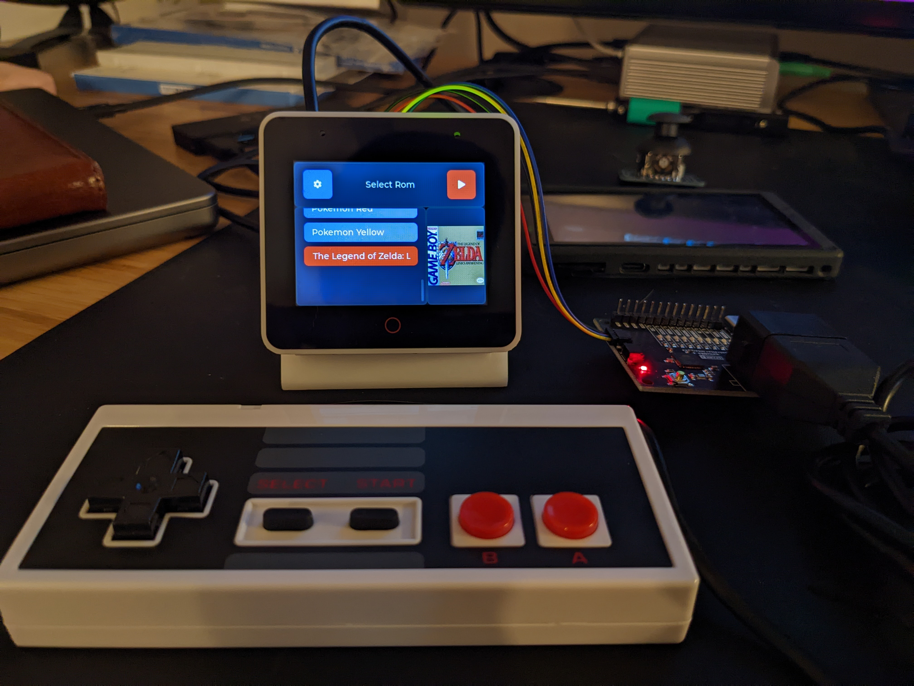
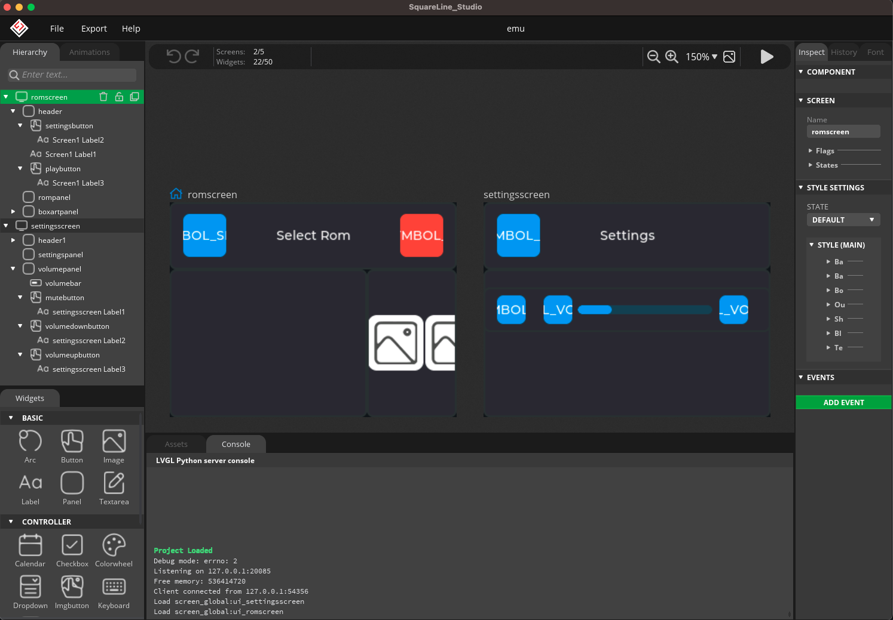

# esp-box-emu
Emulator(s) running on ESP BOX

## Description

This project is a little retro game emulation system running on ESP32-S3-BOX. It
is built using the following:

- [ESPP](http://github.com/esp-cpp/espp)
- [LVGL](http://github.com/lvgl/lvgl)
- [Squareline Studio](http://squareline.io) (for designing and generating LVGL)
- Nofrendo (NES emulator)
- GNUBoy (GB / GBC emulator)

## Videos

### Gameboy Color

This video shows settings page (with audio control and video scaling control), and then Links Awakening DX. While running the ROMs, the video scaling can be toggled through the three options (Original, Fit, and Fill) using the BOOT button on the side of the ESP-S3-BOX and the audio output can be toggled on / off using the MUTE button on the top.

https://user-images.githubusercontent.com/213467/202577104-da104296-c888-47f4-bb69-e1dcac7f3a08.mp4

### NES (Super Mario Bros. and Zelda, turning audio up for zelda :) )

https://user-images.githubusercontent.com/213467/200666734-d5fdd27e-d335-462b-9f27-c93c5750de01.mp4

https://user-images.githubusercontent.com/213467/201548463-9870a1c1-886c-4540-b1c6-c7ed3b49d8a5.mp4

### Gameboy (Pokemon and Links Awakening)

https://user-images.githubusercontent.com/213467/200667103-71425aa6-3e77-41b1-83d1-c2072a1a0ecb.mp4

Older Videos:
* [heavily compressed](https://user-images.githubusercontent.com/213467/200664203-46058c44-3025-4e81-973f-27ada573d5d2.mp4)
* [just zelda](https://user-images.githubusercontent.com/213467/199843965-1bf38a5f-2cc6-4ff0-adba-bbd67b366bc3.mp4)

## Images

<table style="padding:10px">
    <tr>
        <td></td>
        <td></td>
    </tr>
    <tr>
        <td></td>
        <td></td>
    </tr>
    <tr>
        <td></td>
        <td></td>
    </tr>
    <tr>
        <td></td>
        <td></td>
    </tr>
    <tr>
        <td></td>
    </tr>
</table>

## Features

This project has the following features (still WIP): 

 - [x] Squareline Studio design files for generating boilerplate LVGL ([SQS files](./squareline), [Generated files](./components/gui/generated))
 - [x] LVGL gui for selecting emulators / roms (showing boxart and name)
 - [x] LVGL gui for controlling settings (such as volume) (using [gui component](./components/gui))
 - [x] Loading of gui data (rom titles and boxart) from metadata file (example [here](./metadata.csv))
 - [x] Audio output (using I2S + es8311 audio codec, [es8311 component](./components/codec))
 - [x] Interaction with [QwiicNes NES gamepad](https://www.sparkfun.com/products/18038)
 - [x] Interaction with analog joystick + buttons (using [controller component](./components/controller))
 - [x] Interaction with d-pad + buttons (using [controller component](./components/controller))
 - [x] Interaction with touchscreen (using [tt21100 component](./components/tt21100))
 - [x] Navigation of LVGL rom menu with controller (up,down,start)
 - [ ] Runnable emulators (automatically selected by rom extension):
   - [x] NES emulator (~100 FPS running Legend of Zelda)
   - [x] GB/GBC emulator (~100 FPS running Link's Awakening DX (GBC))
   - [ ] SNES emulator
   - [ ] SMS / Genesis emulator
 - [x] LittleFS file system for local storage of roms and metadata
 - [x] Support for uSD (FAT) filesystem over SPI
 - [x] Memory mapping of selected rom data from storage (littlefs or uSD) into
       raw data partition (SPIFLASH)
 - [X] Emulator framebuffers on SPIRAM 
 - [x] Some hacky support for BT Gamepad input (see note below regarding wifi use.) 
 - [x] Refactor to have a blit function which queues up transfers for screen into a task
 - [x] Scaling of GB/GBC display to support original, fit, and fill video scaling modes
 - [x] Scaling for NES display to support original (which is fit) and fill video scaling modes
 - [x] Use mute button to toggle volume output while running the roms
 - [x] Use boot button to switch between video scaling modes while running the roms
 - [x] Feedback through tiny haptic motor (DRV2605)
 - [x] Save state
 - [x] Load state
 - [ ] Feedback through BLDC haptic motor (see
       https://github.com/scottbez1/smartknob)
 - [ ] State management (UI to select state when loading roms, ui/buttons for
       saving/loading states while running)
 - [ ] Favorites menu?
 - [ ] Recently played menu?
 - [ ] Show emulator with rom for easy sorting / finding
 - [ ] Graphics in black borders next to rom display during NES / GB/C emulation
 - [ ] Schematic / Layout for control board peripheral containing
   - [ ] joystick / D-Pad / Button inputs (via i2c I/O expander / ADC)
   - [ ] Battery
   - [ ] Charger circuit
   - [ ] TMC BLDC driver chip
   - [ ] ABI magnetic encoder chip
   - [ ] BLDC motor (haptics)
 - [ ] CAD for control board peripheral case
 - [ ] Use same audio + video tasks for both NES and GB/C emulation
 - [ ] FTP Client for browsing remote FTP server of roms and displaying their
       data in LVGL

 NOTE: For BT gamepad input I'm use the associated
 [controller.py](./controller.py) script which will send the input reports from
 a BT gamepad (in this case an 8BitDo Pro 2) over UDP to the ESP-BOX-EMU which
 converts those input reports and sets the state of the input device for the NES
 emulator appropriately. Because this is annoying, I've moved over to using the
 [qwiicnes component](./components/qwiicnes) configured in the [input processing
 section](./components/box-emu-hal/src/input.cpp) of the [box-emu-hal
 component](./components/box-emu-hal).
    
### Support for dynamically loading emulators (TBD)

 Down the line I'd like to add the ability to load the emulator cores from the
 FTP server (which would be pre-compiled ESP32 libraries) so that they wouldn't
 take up as much space on the ESP32 itself. Right now that's not a huge concern
 though because the ESP (S3 module in the ESP BOX especially) has more than
 enough flash for the emulators so assuming their RAM can be managed it won't be
 much of an issue.
 
 Info for loading elf files at runtime:
 https://github.com/niicoooo/esp32-elfloader.
 [Here](https://github.com/joltwallet/jolt_wallet/tree/master/jolt_os/jelf_loader)
 is another implementation.

## Filsystem / Storage

The emu-box supports both on-board FLASH storage through LittleFS (limited to
the 16 MB flash chip in the S3 in the box) as well as support for external FAT
filesystems on a uSD card connected via SPI (this is the DEFAULT option):

| uSD SPI | ESP32 GPIO (exposed via PMOD header) |
|---------|--------------------------------------|
| CS      | 10                                   |
| MOSI    | 11                                   |
| MISO    | 13                                   |
| SCLK    | 12                                   |

The storage can be changed via `menuconfig`.

### Using LittleFS (Internal FLASH):

You will need to set up a `flash_data/` folder which contains your roms (.nes,
.gb, .gbc), images (.jpg), and metadata.csv. (See next section for more info
about Rom Images and the metadata file). The contents of this folder will be
flashed into the `littlefs` partition.

At least once, you'll need to update the
[./main/CMakeLists.txt](./main/CMakeLists.txt) to uncomment the line that has
`FLASH_IN_PROJECT` as part of the `littlefs_create_partition_image` command -
this will flash all files in your `flash_data/` folder onto the `littlefs`
partition on the embedded FLASH chip. Alternatively, you can use the
`esptool.py`, `parttool.py` as mentioned in [the SPIFFS
docs](https://docs.espressif.com/projects/esp-idf/en/latest/esp32/api-reference/storage/spiffs.html).

### Using FAT (external uSD card):

Format your uSD card as a FAT filesystem and add your roms (.nes, .gb, .gbc),
images (.jpg), and metadata.csv. (See next section for more info about Rom
Images and the metadata file). Make sure the uSD card is plugged into the socket
and the wires are properly connected to the pins (including 3.3V and GND) listed
above.

## ROM Images

For ease of use, there is a
[./boxart/source/resize.bash](./boxart/source/resize.bash) script which will
resize all `jpg` images in the `boxart/source` folder to be 100x px wide (keep
aspect ratio but make width 100 px) and put the resized versions in the `boxart`
folder. You can then copy them onto your sd card and update your metadata file
appropriately.

### Metadata.csv format

``` csv
<rom filename>, <rom boxart filename>, <rom display name>
```

Example:

``` csv
mario.nes, boxart/mario.jpg, Mario Bros.
super_mario_1.nes, boxart/super_mario_bros_1.jpg, Super Mario Bros.
super_mario_3.nes, boxart/super_mario_bros_3.jpg, Super Mario Bros. 3
zelda.nes, boxart/zelda1.jpg, The Legend of Zelda
zelda_2.nes, boxart/zelda2.jpg, The Legend of Zelda 2: the Adventure of Link
mega_man.nes, boxart/megaman1.jpg, MegaMan
metroid.nes, boxart/metroid1.jpg, Metroid
pokemon_blue.gb, boxart/pokemon_blue.jpg, Pokemon Blue
pokemon_red.gb, boxart/pokemon_red.jpg, Pokemon Red
pokemon_yellow.gbc, boxart/pokemon_yellow.jpg, Pokemon Yellow
links_awakening.gb, boxart/tloz_links_awakening.jpg, The Legend of Zelda: Link's Awakening
links_awakening.gbc, boxart/tloz_links_awakening_dx.jpg, The Legend of Zelda: Link's Awakening DX
```

## References and Inspiration:

### ESP32 S3 Box Info:

It uses GPIO_NUM_46 to control power to the speaker, so if you do not set that
as output HIGH, then you will never hear anything T.T

The ESP32 S3 Box has two PMOD headers, PMOD1 and PMOD2, which have the following
pins:

* PMOD1
  * IO40 (I2C_SCL)
  * IO41 (I2C_SDA)
  * IO38
  * IO39
  * IO42
  * IO21
  * IO19 (USB_D-, U1RTS, ADC2_CH8)
  * IO20 (USB_D+, U1CTS, ADC2_CH9)
* PMOD2
  * IO09 (FSPIHD, TOUCH9, ADC1_CH8)
  * IO10 (FSPICS0, TOUCH10, ADC1_CH9)
  * IO11 (FSPID, TOUCH11, ADC2_CH0)
  * IO12 (FSPICLK, TOUCH12, ADC2_CH1)
  * IO13 (FSPIQ, TOUCH13, ADC2_CH2)
  * IO14 (FSPIWP, TOUCH14, ADC2_CH3)
  * IO44 (U0RXD)
  * IO43 (U0TXD)

#### LCD

The LCD is a ST7789 320x240 BGR display connected via SPI.

ESP32s3 LCD Pinout:

| LCD Function   | ESP I/O Pin |
|----------------|-------------|
| Data / Command | 4           |
| Chip Select    | 5           |
| Serial Data    | 6           |
| Serial Clock   | 7           |
| Reset          | 48          |
| Backlight      | 45          |

#### Touch

The ESP32S3 Box uses a capacitive touch controller connected via I2C.

The touch driver can be either the TT21100 or Ft5x06 chip.

NOTE: it appears the one I have (regular ESP32 S3 BOX) which has the red circle
at the bottom of the display (the `HOME` button) uses the TT21100 chip.

#### Audio

The ESP32s3 Box has a few audio codec coprocessors connected simultaneously to
I2S (data) and I2C (configuration). It uses an encoder codec chip (ES7210) for
audio input from the multiple mics on-board, and a decoder chip (es8311) for
audio output to the speaker (output power controlled by GPIO 46).

ESP32s3 Audio Pinout:

| Audio Function | ESP I/O Pin |
|----------------|-------------|
| I2S MCLK       | 2           |
| I2S SCLK       | 17          |
| I2S LRCK       | 47          |
| I2S Data Out   | 15          |
| I2S Data In    | 16          |
| Speaker Power  | 46          |
| Mute Button    | 1           |

I2C Pinout (shared with touchscreen chip above):

| I2C Function | ESP I/O Pin |
|--------------|-------------|
| SCL          | 18          |
| SDA          | 8           |

### Controllers

#### Sparkfun QwiicNES

The Sparkfun QwiicNES ([product page](https://www.sparkfun.com/products/18038),
[library](https://github.com/sparkfun/SparkFun_QwiicNES_Arduino_Library)) is a
NES controller adapter that supports direct GPIO and I2C. The
[controller](./components/controller) component we have supports direct GPIO
configuration if you choose to use it (find the configuration in the
[./components/box-emu-hal/src/input.cpp](./components/box-emu-hal/src/input.cpp)).

It also however has a ATmega 32u4 which allows it to act as a USB gamepad and
exposes the NES gamepad over I2C as well. For ease of use, the I2C functionality
has been wrapped into a [qwiicnes component](./components/qwiicnes). There is an
example of using this qwiicnes component in the component's example foler.

#### Joy bonnet

The [joy bonnet](https://pinout.xyz/pinout/joy_bonnet) was designed as a
raspberry pi hat which has abxy, start/select, analog joystick, and player 1 /
player 2 buttons. It's useful for prototyping input / hardware and testing how
well the emulators run (by playing them of course ;) )

The joystick is routed out via an ADS1015 I2C ADC chip (addr 0x48), with the
__Y-axis__ mapped to __channel 0__, and the __X-axis__ mapped to __channel 1__.
[see
here](https://github.com/adafruit/Adafruit-Retrogame/blob/master/joyBonnet.py)

Pinout (pin number is w.r.t. header, not pi GPIO):

| Button  | Joy Bonnet Header Pin Number |
|---------|------------------------------|
| A       | 32                           |
| B       | 31                           |
| X       | 36                           |
| Y       | 33                           |
| Start   | 37                           |
| Select  | 38                           |
| Ground  | 6, 9, 14, 20, 25, 30, 34, 39 |
| 5V      | 2, 4                         |
| 3V3     | 1, 17                        |
| I2C SDA | 3                            |
| I2C SCL | 5                             |

### Other NES Emulators
* https://github.com/nesemu/NESemu
* https://github.com/NiwakaDev/NIWAKA_NES
* https://github.com/kanathan/plainNES
* https://github.com/blagalucianflorin/lbnes
* https://github.com/daniel5151/ANESE
* https://github.com/Grandduchy/YaNES

### Useful Background / Information
* https://www.zophar.net/nes.html
* https://yizhang82.dev/nes-emu-overview
* https://www.gridbugs.org/zelda-screen-transitions-are-undefined-behaviour/
* https://bgb.bircd.org/pandocs.htm
* https://github.com/pebri86/esplay-gb
* https://github.com/hex007/esp32-gnuboy
* https://github.com/rofl0r/gnuboy
* https://github.com/zid/gameboy
* https://github.com/Jean-MarcHarvengt/MCUME
* https://github.com/OtherCrashOverride/go-play
* [SNES Signal Reference](https://gamefaqs.gamespot.com/snes/916396-super-nintendo/faqs/5395)
* [NES Signal Reference](https://wiki.nesdev.com/w/index.php/Standard_controller)
* [Genesis Signal Reference](https://www.raspberryfield.life/2019/03/25/sega-mega-drive-genesis-6-button-xyz-controller/)
