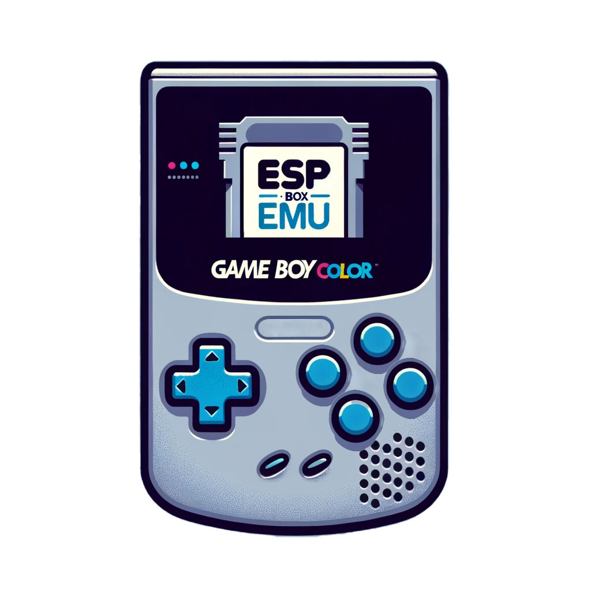
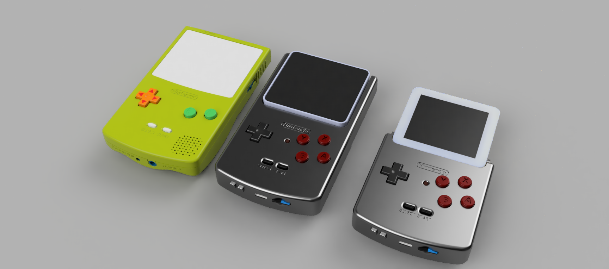

# esp-box-emu

<table style="padding:10px">
    <tr>
        <td></td>
        <td></td>
    </tr>
</table>


https://github.com/user-attachments/assets/2d3da6ea-2e80-42c3-bbd6-5a2c59601201

<!-- markdown-toc start - Don't edit this section. Run M-x markdown-toc-refresh-toc -->
**Table of Contents**

- [esp-box-emu](#esp-box-emu)
  - [Overview](#overview)
  - [Images and Videos](#images-and-videos)
  - [Parts](#parts)
  - [Features](#features)
  - [Cloning](#cloning)
  - [Build and Flash](#build-and-flash)
  - [Rom Setup and Configuration (uSD Card)](#rom-setup-and-configuration-usd-card)
    - [ROM Images](#rom-images)
    - [Metadata.csv format](#metadatacsv-format)
  - [References and Inspiration:](#references-and-inspiration)
    - [Other NES Emulators](#other-nes-emulators)
    - [Other Genesis Emulators](#other-genesis-emulators)
    - [Useful Background / Information](#useful-background--information)

<!-- markdown-toc end -->

## Overview

The ESP-BOX-EMU is a gameboy-inspired add-on for the ESP32-S3-BOX and
ESP32-S3-BOX-3 which provides:
- Game Controller (gamepad input with a/b/x/y, start/select, d-pad)
- LiPo battery (1000 mAh) with charging over USB-C
- Micro-SD card for storing roms, boxart, and savegames
- TinyUSB MSC device wrapping the uSD card
- Volume +/- buttons
- USB-C port for charging and programming
- Haptics (using LRA powered by DRV2605)
- Custom software stack including:
  - NES Emulator (nofrendo)
    - Regular Controls (D-Pad/A/B/Start/Select)
    - Unlocked mode (fastest execution), toggled with the X button
  - MSX I / II Emulator (fmsx)
    - Regular Controls (D-Pad/A/B/Start/Select)
  - Gameboy / Gameboy Color emulator (gnuboy)
    - Regular Controls (D-Pad/A/B/Start/Select)
    - Unlocked mode (fastest execution), toggled with the X button
  - Sega Master System / Game Gear emulator (smsplus)
    - Regular Controls (D-Pad/A/B/Start/Select)
    - Unlocked mode (fastest execution), toggled with the X button
  - Genesis emulator (gwenesis) - full speed / buttery smooth when muted; unmuted it runs a little slower but has nice sound
    - Regular Controls (D-Pad/A/B/C/Start/Select) (note: A is mapped to B, B is mapped to A, and C is mapped to Y)
  - Doom engine (prboom) - full speed with audio and control inputs. A is fire/enter, B is strafe/backspace, X is use, Y is weapontoggle, START is escape, and SELECT is map.
  - LVGL main menu with rom select (including boxart display) and settings page
    (all generated from Squareline Studio)
  - LVGL emulation paused menu with save slot select, save slot image display,
    and configuration (sound, brightness, display, etc.). (all generated from
    Squareline Studio)

## Images and Videos


https://github.com/esp-cpp/esp-box-emu/assets/213467/3b77f6bd-4c42-417a-9eb7-a648f31b4008

https://github.com/esp-cpp/esp-box-emu/assets/213467/a3d18d03-c6a1-4911-89d1-e18119e8cc03

## Parts

This project is designed to be in the same form factor as the Gameboy Color and
to reuse the same button plastics and membranes for a good play feel.

The housing is designed to be 3d printed (I use PLA or PETG on Prusa i3 mk3+),
and assembled with M3 screws.

These are the parts / sources I'm using for stock / replacement GBC membranes
and buttons.

- [Silicone pads for gameboy color (1)](https://funnyplaying.com/collections/product/products/gbc-replacement-silicone-pads)
- [Silicone pads for gameboy color (2)](https://www.retromodding.com/products/game-boy-color-silicone-pads)
- [Gameboy Color Button Plastics](https://funnyplaying.com/collections/product/products/cgb-custom-buttons?variant=39333911920701)

<a href="https://www.pcbway.com/project/shareproject/ESP_BOX_EMU_92551d33.html"></a>

Link to Fusion 360 CAD (Free Version):

[](https://a360.co/3le5oCQ)

The printable files can be found in the [./mcad](./mcad) folder or can be
downloaded from
[printables](https://www.printables.com/model/396931-esp-box-emu).

The electrical files can be found in the [./ecad](./ecad) folder. There are both Fusion/Eagle files as well as [atopile](https://atopile.io) + [kicad](https://kicad.org) files.

## Features

This project has the following features (still WIP): 

 - [x] Squareline Studio design files for generating boilerplate LVGL ([SLS files](./squareline), [Generated files](./components/gui/generated))
 - [x] LVGL gui for selecting emulators / roms (showing boxart and name)
 - [x] LVGL gui for controlling settings (such as volume, video, haptics)
 - [x] Loading of gui data (rom titles and boxart) from metadata file (example [here](./metadata.csv))
 - [x] Audio output (using I2S + es8311 audio codec, [es8311 component](./components/codec))
 - [x] User input with d-pad + buttons (a/b/x/y, start/select) (using MCP23x17 [v0 hardware] or AW9523 [v1 hardware])
 - [x] Interaction with touchscreen (using [tt21100 component](./components/tt21100))
 - [x] Navigation of LVGL rom menu with controller (up,down,a,b,start)
 - [x] Shared memory system shared between emulators to allow for many emulators to compile in together while still enabling their main state to be stored in fast internal memory. 
 - [x] Runnable emulators (automatically selected by rom extension):
   - [x] NES emulator
   - [x] GB/GBC emulator
   - [x] Sega Master System (SMS) / GameGear (GG) emulator
   - [x] MSX emulator
   - [x] Sega Mega Drive / Genesis emulator
   - [x] Doom
   - [ ] Dark Forces (WIP)
   - [ ] SNES emulator (WIP)
 - [x] uSD card (FAT) filesystem over SPI
 - [x] TinyUSB MSC device for optionally exposing the uSD to the attached USB host
 - [x] Memory mapping of selected rom data from storage into raw data partition
       (SPIFLASH)
 - [X] Emulator framebuffers on SPIRAM 
 - [x] Queued transfers of screen data for maximum draw speed while running emulation
 - [x] Scaling of emulator video data to support ORIGINAL, FIT, and FILL modes of display data to screen
 - [x] Use mute button to toggle volume output while running the roms
 - [x] Feedback through tiny haptic motor (DRV2605)
 - [x] Save state (with automated save screenshot creation saved to uSD card)
 - [x] Load state (up to 5 slots per game)
 - [x] State management (UI to select state when loading roms, ui/buttons for
       saving/loading states while running, and displaying save screenshots)
 - [x] Schematic / Layout for control board peripheral containing
   - [x] joystick / D-Pad / Button inputs (via i2c I/O expander / ADC)
   - [x] Battery
   - [x] Charger circuit
   - [x] DRV2605 haptic motor (LRM / ECM)
   - [x] uSD card
   - [x] boost converter
   - [x] usb 2.0 passthrough from usb-c
 - [x] CAD for control board peripheral case in the same footprint as GBC
   - [x] USB-C Port for programming / charging
   - [x] uSD card slot for roms
   - [x] start / select buttons (same location as GBC)
   - [x] ABXY buttons (basically same size / location as GBC)
   - [x] Directional Pad (same size / location as GBC)
 - [x] Use same audio + video tasks for all emulators
 - [ ] Graphics in black borders next to rom display during NES / GB/C emulation
    
## Cloning

Since this repo contains a submodule, you need to make sure you clone it
recursively, e.g. with:

``` sh
git clone --recurse-submodules git@github.com:esp-cpp/esp-box-emu
```

Alternatively, you can always ensure the submodules are up to date after cloning
(or if you forgot to clone recursively) by running:

``` sh
git submodule update --init --recursive
```

## Build and Flash

Build the project and flash it to the board, then run monitor tool to view serial output:

```
idf.py -p PORT flash monitor
```

(Replace PORT with the name of the serial port to use.)

(To exit the serial monitor, type ``Ctrl-]``.)

See the Getting Started Guide for full steps to configure and use ESP-IDF to build projects.

## Rom Setup and Configuration (uSD Card)

Format your uSD card as a FAT filesystem and add your roms (.nes, .gb, .gbc),
images (.jpg), and metadata.csv.

### ROM Images

For ease of use, there is a
[./boxart/source/resize.bash](./boxart/source/resize.bash) script which will
resize all `jpg` images in the `boxart/source` folder to be 100x px wide (keep
aspect ratio but make width 100 px) and put the resized versions in the `boxart`
folder. You can then copy them onto your sd card and update your metadata file
appropriately.

### Metadata.csv format

``` csv
<rom filename>, <rom boxart filename>, <rom display name>
```

Example:

``` csv
mario.nes, boxart/mario.jpg, Mario Bros.
super_mario_1.nes, boxart/super_mario_bros_1.jpg, Super Mario Bros.
super_mario_3.nes, boxart/super_mario_bros_3.jpg, Super Mario Bros. 3
zelda.nes, boxart/zelda1.jpg, The Legend of Zelda
zelda_2.nes, boxart/zelda2.jpg, The Legend of Zelda 2: the Adventure of Link
mega_man.nes, boxart/megaman1.jpg, MegaMan
metroid.nes, boxart/metroid1.jpg, Metroid
pokemon_blue.gb, boxart/pokemon_blue.jpg, Pokemon Blue
pokemon_red.gb, boxart/pokemon_red.jpg, Pokemon Red
pokemon_yellow.gbc, boxart/pokemon_yellow.jpg, Pokemon Yellow
links_awakening.gb, boxart/tloz_links_awakening.jpg, The Legend of Zelda: Link's Awakening
links_awakening.gbc, boxart/tloz_links_awakening_dx.jpg, The Legend of Zelda: Link's Awakening DX
```

## References and Inspiration:

### Other NES Emulators
* https://github.com/nesemu/NESemu
* https://github.com/NiwakaDev/NIWAKA_NES
* https://github.com/kanathan/plainNES
* https://github.com/blagalucianflorin/lbnes
* https://github.com/daniel5151/ANESE
* https://github.com/Grandduchy/YaNES

### Other Genesis Emulators
* https://github.com/h1romas4/m5stack-genplus
* https://github.com/libretro/blastem

### Useful Background / Information
* https://github.com/alnacle/awesome-emulators
* https://www.zophar.net/nes.html
* https://yizhang82.dev/nes-emu-overview
* https://www.gridbugs.org/zelda-screen-transitions-are-undefined-behaviour/
* https://bgb.bircd.org/pandocs.htm
* https://github.com/pebri86/esplay-gb
* https://github.com/hex007/esp32-gnuboy
* https://github.com/rofl0r/gnuboy
* https://github.com/zid/gameboy
* https://github.com/Jean-MarcHarvengt/MCUME
* https://github.com/OtherCrashOverride/go-play
* [SNES Signal Reference](https://gamefaqs.gamespot.com/snes/916396-super-nintendo/faqs/5395)
* [NES Signal Reference](https://wiki.nesdev.com/w/index.php/Standard_controller)
* [Genesis Signal Reference](https://www.raspberryfield.life/2019/03/25/sega-mega-drive-genesis-6-button-xyz-controller/)
* [DIY Gameboy](https://learn.adafruit.com/pigrrl-raspberry-pi-gameboy/overview)
