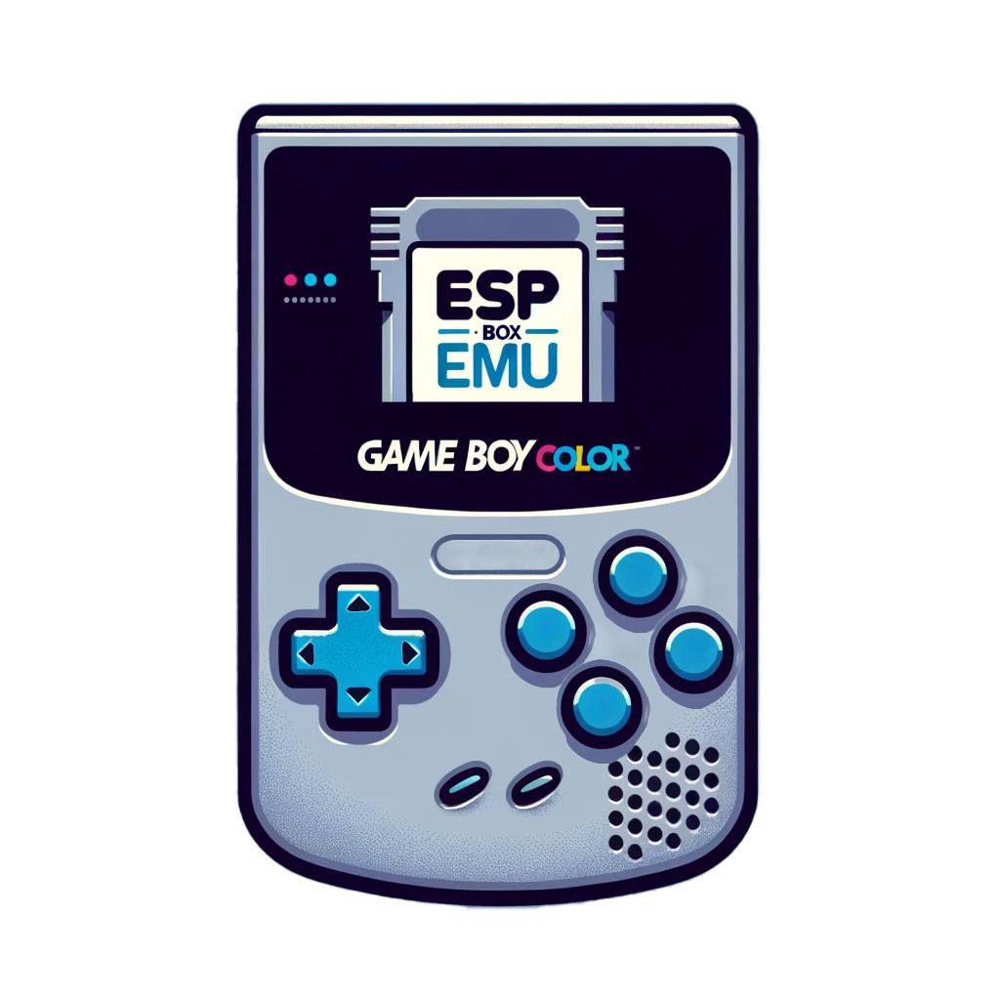
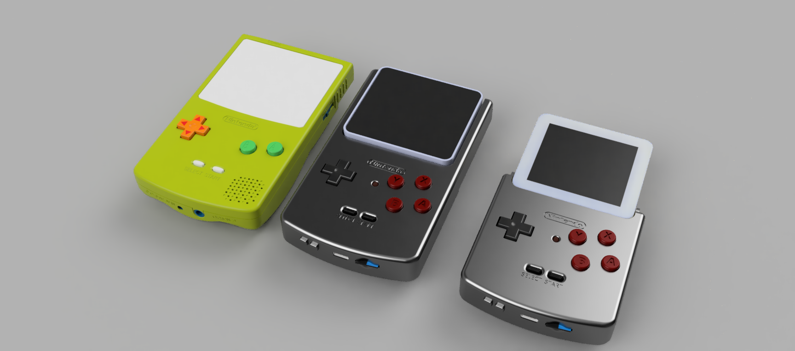

# esp-box-emu

<table style="padding:10px">
    <tr>
        <td></td>
        <td></td>
    </tr>
</table>

[](https://github.com/esp-cpp/esp-box-emu/releases)
[](./LICENSE)
[](https://www.espressif.com/en/products/socs/esp32-s3)

> A pocket-sized, Game Boy-style retro **emulation handheld** built around the
> ESP32-S3-BOX. Drop in a micro-SD card of ROMs and play NES, Game Boy / Color,
> Sega, MSX, and Genesis games — plus a full-speed port of **Doom** — on hardware
> you can 3D print and build yourself.


https://github.com/user-attachments/assets/2d3da6ea-2e80-42c3-bbd6-5a2c59601201

<!-- markdown-toc start - Don't edit this section. Run M-x markdown-toc-refresh-toc -->
**Table of Contents**

- [esp-box-emu](#esp-box-emu)
  - [Overview](#overview)
  - [Emulators](#emulators)
  - [Gallery](#gallery)
  - [Quick Start — Play It](#quick-start--play-it)
  - [Build the Hardware](#build-the-hardware)
  - [Build the Firmware](#build-the-firmware)
  - [ROMs and SD Card Setup](#roms-and-sd-card-setup)
    - [Boxart images](#boxart-images)
    - [metadata.csv format](#metadatacsv-format)
  - [Features and Roadmap](#features-and-roadmap)
  - [References and Inspiration](#references-and-inspiration)
  - [License](#license)

<!-- markdown-toc end -->

## Overview

The ESP-BOX-EMU turns an [ESP32-S3-BOX or
ESP32-S3-BOX-3](https://github.com/espressif/esp-box) into a handheld retro game
console. A custom add-on board and 3D-printed shell wrap the BOX in a Game Boy
Color form factor — real d-pad and buttons, battery, haptics, and a micro-SD
slot — and the firmware runs a stack of emulators behind a polished LVGL
interface with boxart, save states, and settings.

**Highlights**

- 🎮 **Six systems + Doom** — NES, Game Boy / Color, Sega Master System / Game
  Gear, Sega Genesis, and MSX 1/2 emulators, plus a full-speed **Doom** port —
  all with sound.
- 🧬 **Full-speed Genesis** — a custom **dual-core** port of gwenesis splits the
  emulation across both of the ESP32-S3's cores (CPU + video on one, the sound
  unit on the other) for full-speed Sega Genesis / Mega Drive *with* audio.
- ⚡ **No reboots** — every core and game loads on demand right from the menu, so
  you can jump between titles and even different systems without ever restarting
  the device.
- 🕹️ **Real controls** — d-pad, A/B/X/Y, Start/Select and volume buttons in a
  familiar Game Boy Color layout; the emulator is auto-selected from the ROM
  file extension.
- 💾 **Load from SD** — keep ROMs, boxart, and save states on a micro-SD card,
  and mount the card over USB-C as a mass-storage drive (TinyUSB MSC).
- 💤 **Save anywhere** — up to 5 save slots per game, each with an
  auto-generated screenshot shown in the load menu.
- 🔋 **Portable** — 1000 mAh LiPo battery with USB-C charging.
- 📳 **Haptics** — LRA haptic feedback (DRV2605), including in-game effects in
  Doom (weapon fire, taking damage, pickups, and more).
- 🖼️ **Polished UI** — LVGL menus for ROM select (with boxart) and settings
  (sound, brightness, display scaling, haptics), designed in Squareline Studio.
- 🛠️ **Fully open hardware** — 3D-printable GBC-style case and an open PCB
  (Fusion/Eagle **and** [atopile](https://atopile.io) + [KiCad](https://kicad.org)),
  all included in this repo.

## Emulators

The right emulator is chosen automatically from each ROM's file extension, and
games load on demand **straight from the menu — no reboot required**. Pick a
title, play, then drop back to the menu and launch a different game (or a
completely different system) without ever restarting the device. Every core runs
with audio, and several offer an **Unlocked mode** (toggle with the **X** button)
that removes the frame-rate cap for maximum speed.

| System | Core | Unlocked mode | Notes |
| --- | --- | :---: | --- |
| NES | [nofrendo](https://github.com/espressif/esp32-nesemu) | ✅ | D-Pad / A / B / Start / Select |
| Game Boy / Color | [gnuboy](https://github.com/rofl0r/gnuboy) | ✅ | D-Pad / A / B / Start / Select |
| Sega Master System / Game Gear | [smsplus](https://github.com/ekeeke/smsplus-gx) | ✅ | D-Pad / A / B / Start / Select |
| Sega Genesis / Mega Drive | [gwenesis](https://github.com/bzhxx/gwenesis) | — | Full speed with sound; 6-button pad (A→B, B→A, C→Y) |
| MSX 1 / 2 | [fmsx](https://fms.komkon.org/fMSX/) | — | D-Pad / A / B / Start / Select |
| Doom | [prboom](https://prboom.sourceforge.net/) | — | Full speed with audio **and haptic feedback** |

> 🧬 **Full-speed Genesis on the S3.** The Genesis core ships with a custom
> **dual-core** modification of gwenesis that spreads the workload across both of
> the ESP32-S3's CPU cores: **core 0** runs the 68000 CPU and VDP (video), while
> **core 1** runs the sound unit (Z80 + YM2612 FM synth + PSG). Sound-chip writes
> are queued and applied in order on core 1, which lets Genesis / Mega Drive
> games run at full speed *with* audio — something a single core can't keep up
> with.

<details>
<summary><strong>Doom controls and haptics</strong></summary>

**Controls:** **A** fire / enter · **B** strafe / backspace · **X** use ·
**Y** weapon toggle · **START** escape · **SELECT** map.

**Haptic feedback** is triggered when you fire a weapon (varies by weapon), take
damage (scaled to the health/armor lost), interact with something (e.g. a door),
or pick up a weapon, ammo, health, armor, a power-up, or a key / card.
</details>

## Gallery


https://github.com/esp-cpp/esp-box-emu/assets/213467/3b77f6bd-4c42-417a-9eb7-a648f31b4008

https://github.com/esp-cpp/esp-box-emu/assets/213467/a3d18d03-c6a1-4911-89d1-e18119e8cc03

## Quick Start — Play It

Already have the add-on hardware (or an ESP32-S3-BOX you want to flash)? You
don't need to build anything from source — a prebuilt one-time **programmer** is
published with every release.

1. Download the `programmer` for your OS (`windows`, `macos`, or `linux`) from
   the latest [releases page](https://github.com/esp-cpp/esp-box-emu/releases).
2. Unzip it.
3. Run it: double-click the `.exe` on Windows, or run it from a terminal on
   macOS / Linux, e.g.:

   ```sh
   ./esp-box-emu_programmer_v1.0.0_macos.bin
   ```

   (The version in the filename matches the release you downloaded.)

Then [set up a micro-SD card](#roms-and-sd-card-setup) with your ROMs and you're
ready to play.

## Build the Hardware

The add-on is designed to match the Game Boy Color form factor and reuse GBC
button plastics and silicone membranes for an authentic feel. The shell is meant
to be 3D printed (PLA or PETG on a Prusa i3 mk3+) and assembled with M3 screws.

**Case / mechanical** — printable files are in [./mcad](./mcad) or on
[Printables](https://www.printables.com/model/396931-esp-box-emu). CAD is on
[Fusion 360 (free viewer)](https://a360.co/3le5oCQ):

[](https://a360.co/3le5oCQ)

**Electronics** — schematic and layout files are in [./ecad](./ecad), provided
as both Fusion/Eagle files and [atopile](https://atopile.io) +
[KiCad](https://kicad.org) sources. You can also order the board directly:

<a href="https://www.pcbway.com/project/shareproject/ESP_BOX_EMU_92551d33.html"></a>

**GBC replacement buttons / membranes** used for a good play feel:

- [Silicone pads for Game Boy Color (1)](https://funnyplaying.com/collections/product/products/gbc-replacement-silicone-pads)
- [Silicone pads for Game Boy Color (2)](https://www.retromodding.com/products/game-boy-color-silicone-pads)
- [Game Boy Color button plastics](https://funnyplaying.com/collections/product/products/cgb-custom-buttons?variant=39333911920701)

## Build the Firmware

This repo uses submodules, so clone it recursively:

```sh
git clone --recurse-submodules git@github.com:esp-cpp/esp-box-emu
```

If you already cloned it non-recursively (or forgot the flag), pull the
submodules with:

```sh
git submodule update --init --recursive
```

Then build, flash, and open the serial monitor with [ESP-IDF](https://docs.espressif.com/projects/esp-idf/en/latest/esp32s3/get-started/index.html):

```sh
idf.py -p PORT flash monitor
```

Replace `PORT` with your board's serial port. To exit the monitor, type
`Ctrl-]`.

## ROMs and SD Card Setup

Format a micro-SD card as **FAT** and add your ROMs (`.nes`, `.gb`, `.gbc`, …),
boxart images (`.jpg`), and a `metadata.csv` file (see the example
[metadata.csv](./metadata.csv)).

### Boxart images

Boxart displays best at 100 px wide. The
[./boxart/source/resize.bash](./boxart/source/resize.bash) script resizes every
`.jpg` in `boxart/source` to 100 px wide (preserving aspect ratio) and writes the
results to the `boxart` folder. Copy those onto the SD card and reference them
from your metadata file.

### metadata.csv format

Each line maps a ROM to its boxart and display name:

```csv
<rom filename>, <rom boxart filename>, <rom display name>
```

Example:

```csv
mario.nes, boxart/mario.jpg, Mario Bros.
super_mario_1.nes, boxart/super_mario_bros_1.jpg, Super Mario Bros.
super_mario_3.nes, boxart/super_mario_bros_3.jpg, Super Mario Bros. 3
zelda.nes, boxart/zelda1.jpg, The Legend of Zelda
zelda_2.nes, boxart/zelda2.jpg, The Legend of Zelda 2: the Adventure of Link
mega_man.nes, boxart/megaman1.jpg, MegaMan
metroid.nes, boxart/metroid1.jpg, Metroid
pokemon_blue.gb, boxart/pokemon_blue.jpg, Pokemon Blue
pokemon_red.gb, boxart/pokemon_red.jpg, Pokemon Red
pokemon_yellow.gbc, boxart/pokemon_yellow.jpg, Pokemon Yellow
links_awakening.gb, boxart/tloz_links_awakening.jpg, The Legend of Zelda: Link's Awakening
links_awakening.gbc, boxart/tloz_links_awakening_dx.jpg, The Legend of Zelda: Link's Awakening DX
```

## Features and Roadmap

A checklist of what's implemented and what's still in progress.

**Emulation**

- [x] Auto-select emulator by ROM extension: NES, GB/GBC, SMS/GG, MSX, Genesis, Doom
- [x] On-demand core loading — every emulator and game loads at runtime with no reboot needed to switch games or systems
- [x] Custom **dual-core Genesis** (gwenesis): 68000 + VDP on one ESP32-S3 core, sound unit (Z80 + YM2612 + PSG) on the other, for full-speed audio and gameplay
- [x] Doom haptic feedback :rocket:
- [x] Save state (with automatic save-screenshot creation to the SD card)
- [x] Load state — up to 5 slots per game, with save-screenshot previews
- [x] Shared-memory system so many emulators can be built in together while keeping their hot state in fast internal RAM
- [ ] Dark Forces (WIP)
- [ ] SNES emulator (WIP)

**User interface**

- [x] LVGL ROM-select menu with boxart and title, navigable by controller
- [x] LVGL settings menu (volume, video, haptics) and in-game pause menu
- [x] GUI data (titles + boxart) loaded from the [metadata file](./metadata.csv)
- [x] Squareline Studio source for the LVGL boilerplate ([SLS files](./squareline), [generated files](./components/gui/generated))

**Video and audio**

- [x] Emulator framebuffers in SPIRAM, with queued screen transfers for maximum draw speed
- [x] Video scaling with ORIGINAL, FIT, and FILL display modes
- [x] Audio output over I2S via the es8311 codec ([codec component](./components/codec))
- [x] Mute button toggles audio while a ROM is running
- [x] Haptic feedback via a DRV2605-driven LRA
- [ ] Decorative graphics in the black borders during NES / GB/C emulation (WIP)

**Storage and input**

- [x] micro-SD (FAT) filesystem over SPI
- [x] TinyUSB MSC device to expose the SD card to an attached USB host
- [x] Memory-mapping of the selected ROM from storage into a raw data partition (SPI flash)
- [x] D-pad + A/B/X/Y + Start/Select input (MCP23x17 on v0 hardware, AW9523 on v1)
- [x] Touchscreen input ([tt21100 component](./components/tt21100))

**Hardware**

- [x] Control-board schematic / layout: joystick / d-pad / buttons (via I²C I/O expander + ADC), battery, charger, DRV2605 haptics, micro-SD, boost converter, and USB 2.0 passthrough from USB-C
- [x] Case CAD in the GBC footprint: USB-C port, micro-SD slot, Start/Select, ABXY, and D-pad in familiar locations

## References and Inspiration

**Other NES emulators**

* https://github.com/nesemu/NESemu
* https://github.com/NiwakaDev/NIWAKA_NES
* https://github.com/kanathan/plainNES
* https://github.com/blagalucianflorin/lbnes
* https://github.com/daniel5151/ANESE
* https://github.com/Grandduchy/YaNES

**Other Genesis emulators**

* https://github.com/h1romas4/m5stack-genplus
* https://github.com/libretro/blastem

**Useful background / information**

* https://github.com/alnacle/awesome-emulators
* https://www.zophar.net/nes.html
* https://yizhang82.dev/nes-emu-overview
* https://www.gridbugs.org/zelda-screen-transitions-are-undefined-behaviour/
* https://bgb.bircd.org/pandocs.htm
* https://github.com/pebri86/esplay-gb
* https://github.com/hex007/esp32-gnuboy
* https://github.com/rofl0r/gnuboy
* https://github.com/zid/gameboy
* https://github.com/Jean-MarcHarvengt/MCUME
* https://github.com/OtherCrashOverride/go-play
* [SNES signal reference](https://gamefaqs.gamespot.com/snes/916396-super-nintendo/faqs/5395)
* [NES signal reference](https://wiki.nesdev.com/w/index.php/Standard_controller)
* [Genesis signal reference](https://www.raspberryfield.life/2019/03/25/sega-mega-drive-genesis-6-button-xyz-controller/)
* [DIY Game Boy](https://learn.adafruit.com/pigrrl-raspberry-pi-gameboy/overview)

## License

This project is licensed under the terms in [LICENSE](./LICENSE).
